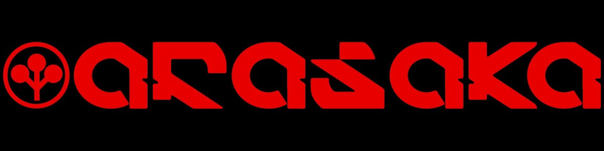

# Exon

IT Specialist for System Integration Apprentice · AP1 exam Feb. 2027

## Core Skills

- Networking & Systems — Subnetting, VLANs, TCP/IP model, Hyper-V virtualization
- Arduino — ELEGOO MEGA 2560, C-based control projects
- Currently building — Python (LeetCode, Exercism) · SQL · JavaScript/TypeScript (Bitburner)
- Goal — CCNA 200-301 (after AP1), then heading toward network/cloud automation

---

<picture>
  <source media="(prefers-color-scheme: dark)" srcset="https://raw.githubusercontent.com/exonflux/exonflux/output/github-contribution-grid-snake-dark.svg">
  <source media="(prefers-color-scheme: light)" srcset="https://raw.githubusercontent.com/exonflux/exonflux/output/github-contribution-grid-snake.svg">
